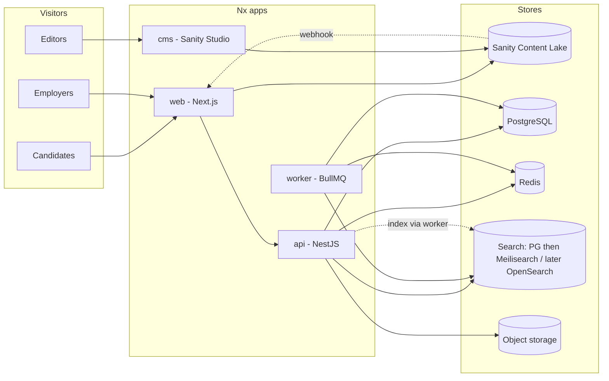

# Hireforge — single source of truth

Canonical product vision, competitor context, technical decisions, and architecture for this repository. **Edit when reality changes.**

**Ownership:** Private proprietary software — **Šljakam**. No open-source license; access via GitHub permissions.

> **Public brand:** The product ships as **Sljakam.com**. The repository codename `hireforge` is internal only and is **not** renamed. This file remains the **technical** source of truth (stack, infra, repo layout, phases). For **product, operations, and brand** decisions (packages, billing, sales ownership, apply flows, performance + simplicity gates), see [`PRODUCT_SSOT_SLJAKAM.md`](./PRODUCT_SSOT_SLJAKAM.md). For step-by-step execution, see [`docs/refactor/MIGRATION_PLAN.md`](./docs/refactor/MIGRATION_PLAN.md).

---

## Companion documents

| Document                                                               | Scope                                                                                                                                                         |
| ---------------------------------------------------------------------- | ------------------------------------------------------------------------------------------------------------------------------------------------------------- |
| [`PRODUCT_SSOT_SLJAKAM.md`](./PRODUCT_SSOT_SLJAKAM.md)                 | Product & operations SSOT for Sljakam.com — brand, scope, personas, packages, billing, sales ownership, lifecycle state machines, KPIs, operating principles. |
| [`docs/refactor/MIGRATION_PLAN.md`](./docs/refactor/MIGRATION_PLAN.md) | Execution plan for the Sljakam refactor — 18 steps with mini-steps and verification gates.                                                                    |
| [`README.md`](./README.md)                                             | Repo entry point: dev setup, scripts, integration check.                                                                                                      |

---

## Sources for this document

| Source                                 | Status                                                                                        |
| -------------------------------------- | --------------------------------------------------------------------------------------------- |
| Pasted planning conversation (ChatGPT) | **Incorporated** — architecture, stack, competitor analysis, CMS split, phases.               |
| Repo `README.md`                       | Short public description; details live here.                                                  |
| Automated fetch of ChatGPT share URL   | **Cannot** retrieve message bodies (see [Note on share links](#note-on-chatgpt-share-links)). |

---

## Naming

| Name                  | Use                                                                          |
| --------------------- | ---------------------------------------------------------------------------- |
| **Hireforge**         | GitHub repository and primary product codename in this repo.                 |
| **TalentForge**       | Alternative codename discussed in planning; not required to match repo name. |
| Public marketing name | TBD later.                                                                   |

---

## Go-to-market: vertical slice first

Launch **narrow**, then expand. Do **not** compete on Infostud’s full breadth on day one.

| Dimension     | Example (tune when locking roadmap)                                                          |
| ------------- | -------------------------------------------------------------------------------------------- |
| **Geography** | One city or region first (e.g. Belgrade) before national/wider Balkans.                      |
| **Vertical**  | One segment first (e.g. tech / IT, or verified SMEs) so listings and language stay coherent. |

**Why:** Search relevance, trust features (verification, salary norms), and messaging compound faster in a **slice** than in an unfocused national board.

---

## Reference competitor

| Field                   | Value                                                                                                                         |
| ----------------------- | ----------------------------------------------------------------------------------------------------------------------------- |
| **Primary reference**   | **Poslovi** (Infostud) — [https://poslovi.infostud.com/](https://poslovi.infostud.com/)                                       |
| **Related B2B surface** | **HR Lab** — ATS, employer tooling, branding, scale claims (e.g. traffic / CV tools — verify on live site).                   |
| **Strategic intent**    | Compete in the **Serbian** market with a **faster, cleaner, more trustworthy** hiring marketplace — not blind feature parity. |

### Win condition (not “another job board”)

Out-execute on:

- **UX** — fewer clicks, clearer filters, better mobile.
- **Speed** — page performance, search latency, publish-to-index delay.
- **Relevance** — search quality, synonyms (SR/EN), ranking.
- **Employer conversion** — posting flow, analytics, branding.
- **Trust** — salary transparency, verified employers, honest application status, response expectations.

Example positioning lines (candidates): e.g. transparent process, less wasted applications, verified employers — refine for final brand.

---

## What the competitor offers (public surface — research summary)

**Strengths to respect**

- Large listing volume; company inventory; search with city/category/area; sorts (newest, expiring).
- Email job alerts; job archive; saved account flows; follow employers; employer profile pages.
- Rich employer pages: about, jobs, benefits, experiences, blog/news, contact, registration info, follow — not a trivial company card.
- Content / SEO: news, blog, legal/advice, research, occupation content — **traffic and authority**.
- Mobile app presence (e.g. browse, apply, attach docs, notifications — per store descriptions).
- **HR Lab**: ATS-style features — screening, scheduling, CV tools, Smart Sort / AI summaries, branding packages, etc.

**Gaps / opportunities (where we can win)**

- **Breadth vs opinionated UX** — legacy portal density; room for a **focused, modern** experience.
- **Salary transparency** — often inconsistent; we can standardize bands / expectations.
- **Trust metrics** — go beyond basic badges: response times, verified salary/process, clearer stages (where product allows).
- **Employer profiles** — strong presentation; we can add **structured comparison**, SLAs, clearer hiring-process storytelling where research supports it.
- **Ecosystem split** — Infostud runs multiple brands (Poslovi, HR Lab, HelloWorld, Startuj, etc.); we can offer a **tighter integrated** journey for a chosen segment (e.g. tech, white-collar, verified SMEs) before expanding.

_Treat competitor capabilities as moving targets — re-verify on live product before major bets._

---

## Locked technical stack

### Monorepo

- **Nx** — one repository: `web`, `api`, `worker`, `cms` (Sanity Studio or equivalent), shared `libs/*`.
- **Package manager:** **pnpm** (per planning).
- **Not** separate FE/BE repos at this stage — atomic changes across contracts, filters, and indexing matter.

### Frontend (`apps/web`)

| Layer           | Choice                                                                                                                                                                                                                                            |
| --------------- | ------------------------------------------------------------------------------------------------------------------------------------------------------------------------------------------------------------------------------------------------- |
| Framework       | **Next.js** (App Router), **React**, **TypeScript**                                                                                                                                                                                               |
| Styling / UI    | **Tailwind CSS**, **shadcn/ui**, **Radix UI**, Lucide                                                                                                                                                                                             |
| Server state    | **TanStack Query**                                                                                                                                                                                                                                |
| Local UI state  | **Zustand** (light use)                                                                                                                                                                                                                           |
| Forms           | **React Hook Form** + **Zod**                                                                                                                                                                                                                     |
| URL state       | Filters / search driven by **URL** (shareable, SEO-friendly)                                                                                                                                                                                      |
| **i18n & URLs** | **Serbian + English** (minimum); locale-aware routes and metadata (e.g. `next-intl` or equivalent). Final URL strategy: locale prefix vs subdomain — **decide before mass content** (see [Internationalization](#internationalization-and-urls)). |
| Tables          | **TanStack Table** — employer/admin dashboards primarily                                                                                                                                                                                          |
| Content         | **Sanity** (preferred) or **MDX** leaner start; editorial + employer-branding blocks                                                                                                                                                              |
| E2E / unit      | **Playwright**; **Vitest** or **Jest**                                                                                                                                                                                                            |

**Why Next (not SPA-only):** SEO for city/category/company/job pages, SSR/streaming, ISR/revalidation, smaller client bundles on public routes.

### Backend (`apps/api`, `apps/worker`)

| Layer           | Choice                                                                                                                                                   |
| --------------- | -------------------------------------------------------------------------------------------------------------------------------------------------------- |
| API             | **NestJS**, **TypeScript**                                                                                                                               |
| **ORM**         | **Drizzle** — SQL-first, type-safe migrations; repositories/services wrap Drizzle queries.                                                               |
| Style           | **CQRS-oriented modular monolith** — full handlers for workflow-heavy domains; lighter for trivial modules (auth, taxonomy)                              |
| Async           | **BullMQ** on **Redis** — indexing, alerts, email fanout, CV processing, expirations                                                                     |
| **Reliability** | **Transactional outbox** for domain writes that must reliably trigger workers/indexing (see [Outbox](#reliability-transactional-outbox)).                |
| API surface     | **REST** first; GraphQL only if a concrete need appears                                                                                                  |
| **Contracts**   | **`libs/contracts`** — shared types + validation; **OpenAPI** generated from Nest (or single source of truth for DTOs) so Next and API **do not drift**. |
| Tests           | **Jest**; integration tests on commands/handlers for critical flows                                                                                      |

**Why Nest (not Next-only backend):** Domain complexity (jobs, applications, moderation, billing, queues) outgrows route handlers; clearer modules, guards, DI, workers.

### Data and infrastructure

| Concern                   | Choice                                                                                                                                                                               |
| ------------------------- | ------------------------------------------------------------------------------------------------------------------------------------------------------------------------------------ |
| System of record          | **PostgreSQL** (via **Drizzle**)                                                                                                                                                     |
| Cache / sessions / queues | **Redis**                                                                                                                                                                            |
| Job search                | **Phased** — see [Search strategy](#search-strategy-phased); **Meilisearch** as the dedicated engine after Postgres; **OpenSearch/Elasticsearch** only when scale/rules justify ops. |
| Objects                   | **S3-compatible** (e.g. S3, R2, MinIO) — CVs, logos, exports                                                                                                                         |
| **Edge / CDN**            | **Not in v1.** Optional later: **Cloudflare** (or Azure Front Door / other) for CDN, WAF, DNS, DDoS — add when traffic or abuse warrants.                                            |
| Compute                   | **Vercel** early for web; **Cloud Run** or **ECS Fargate** for API/workers; **Hetzner** / **Azure** VMs or containers as alternatives; avoid **Kubernetes** day one                  |
| Email                     | e.g. **Resend** / **Postmark**                                                                                                                                                       |
| SMS/OTP                   | Twilio / Infobip / local provider as needed                                                                                                                                          |
| Errors                    | **Sentry** (FE + BE)                                                                                                                                                                 |
| Product analytics         | **PostHog**                                                                                                                                                                          |
| Metrics                   | **OpenTelemetry**; **Prometheus** + **Grafana** if/when needed                                                                                                                       |
| Auth                      | **JWT access + refresh**; Nest guards; optional **Auth.js** for smoother web auth — **business rules stay in Nest**                                                                  |

---

## API contracts

- **`libs/contracts`:** shared enums, DTO shapes, **Zod** schemas where useful for forms and validation parity.
- **Server API:** Nest DTOs stay aligned with contracts — prefer **codegen** from OpenAPI or **import shared types** so job filters, apply payloads, and errors are identical in Next and Nest.
- **Versioning:** plan URL prefix (`/v1`) or header strategy before public partners; internal web can move with API until then.

---

## Reliability: transactional outbox

Side effects (search index updates, alert fanout, emails) **must not** rely on “DB commit then fire-and-forget queue send” without protection.

**Pattern:**

1. In the **same PostgreSQL transaction** as the business write, insert a row into an **`outbox`** table (event type, payload, `created_at`).
2. After commit, a **worker** (or poller) reads new outbox rows, enqueues **BullMQ** jobs / calls indexers, marks rows processed (with idempotency).
3. Retries and failures are isolated to the worker; the **domain state** and **intent to notify** stay consistent.

This pairs naturally with **CQRS** command handlers: “commit state + append outbox event” in one transaction.

---

## Search strategy (phased)

| Phase                           | Engine                                         | Role                                                                                                                                                              |
| ------------------------------- | ---------------------------------------------- | ----------------------------------------------------------------------------------------------------------------------------------------------------------------- |
| **1 — MVP**                     | **PostgreSQL** full-text (`tsvector`, indexes) | Ship fast; one system; good enough for early volume in the **vertical slice**.                                                                                    |
| **2 — Dedicated search**        | **Meilisearch**                                | Typo tolerance, facets, simpler ops than OpenSearch; **self-host** on Hetzner/Azure next to the stack; workers sync **denormalized job documents** from Postgres. |
| **3 — Heaviest scale / tuning** | **OpenSearch** or **Elasticsearch**            | When synonym packs, ranking formulas, or volume justify JVM cluster + operational cost.                                                                           |

**Writes:** Always authoritative in Postgres; search engines are **projections** (rebuilt from events/outbox + workers).

**Reads:** Query the active search layer for list/search; Postgres for transactional detail and apply.

**Synonyms / locales:** Serbian–English mixed queries, HR abbreviations — maintain dictionaries in the search layer when leaving pure Postgres.

---

## CQRS and Nx together

- **Nx** = repo structure, boundaries, affected CI, shared libs.
- **CQRS** = how workflow-heavy **domains** are modeled inside Nest (commands, queries, events).

**Heavy CQRS from day one (jobs, applications, notifications, billing, moderation, search indexing, analytics ingestion).**  
**Lighter (still consistent boundaries):** auth, taxonomy, CMS glue, simple preferences.

Avoid: microservices day one, event sourcing day one, textbook CQRS for every trivial CRUD.

---

## CMS vs application (hybrid — locked)

| Owned by Nest + Postgres + employer/admin UI                    | Owned by CMS (Sanity preferred) + Studio                                                       |
| --------------------------------------------------------------- | ---------------------------------------------------------------------------------------------- |
| Job ads (lifecycle, moderation, packages, screening, analytics) | Editorial: blog, guides, SEO landings                                                          |
| Applications, pipeline, permissions                             | Rich **employer branding** blocks: story, culture, benefits, media, testimonials, process copy |
| Verification, billing, audit                                    | Modular marketing pages where applicable                                                       |
| Core company facts (legal name, PIB, HQ, etc.)                  | Portable Text / structured blocks for narrative content                                        |

**Never:** primary source of truth for jobs or applications in CMS.

**Next.js** composes public pages from **API data + CMS content**; webhooks → **revalidation** for ISR.

**Alternative CMS:** **Payload** (TS-first, self-hosted) if full stack ownership beats Sanity’s hosted Content Lake.

**Monorepo:** `apps/cms` or `apps/studio` for Studio; Sanity data still lives on **Sanity’s backend** unless using Payload.

### Employer profile: one source of truth per field

Avoid duplicate editable copies of the same fact in Postgres and Sanity.

| Kind of data                                                                       | System of truth                                                                                 | Consumed by                                              |
| ---------------------------------------------------------------------------------- | ----------------------------------------------------------------------------------------------- | -------------------------------------------------------- |
| Legal name, registration id (PIB), verification status, job counts, permissions    | **Postgres**                                                                                    | CMS may **display** read-only refs; APIs enforce updates |
| Long-form culture story, hero media, marketing blocks, blog-style employer content | **Sanity** (or CMS)                                                                             | Next renders; Nest does not duplicate editable text      |
| Slug, SEO title                                                                    | **Single owner** — usually Next resolves from CMS + API merge rules documented here when locked |

If a field could live in both places, **pick one writer** and make the other read-only or synced by an explicit pipeline.

---

## Internationalization and URLs

- **Locales:** At minimum **Serbian (`sr`)** and **English (`en`)** for UI and SEO-critical strings.
- **URLs:** Prefer stable, locale-prefixed paths (e.g. `/sr/...`, `/en/...`) or agreed subdomain strategy — **settle before** building thousands of SEO pages.
- **Job content:** Employer-entered text may stay single-locale initially; UI chrome and filters must be i18n-ready.
- **Search:** Synonym and stopword lists **per locale** when using Meilisearch or OpenSearch.

---

## Mobile strategy (lightweight — not MVP-heavy)

- **v1:** **Responsive web** on Next.js; touch-friendly search and apply; performance budgets for mid-tier phones.
- **Later (optional):** **PWA** (installable, push if needed) — only if metrics justify.
- **Native app (iOS/Android):** **Out of scope for early MVP**; **design APIs and auth** so a future client can reuse the same Nest contracts without a rewrite.
- **Competitor context:** Infostud has mobile apps; we match **experience** on web first, not parity on app stores on day one.

---

## Domain model (core entities — reference)

User, CandidateProfile, Employer, EmployerMember, CompanyProfile, JobPost, JobCategory, Location, Application, CV/ResumeAsset, SavedJob, JobAlertSubscription, EmployerFollower, ScreeningQuestion/Answer, Interview, Notification, Plan/Package, Invoice/Payment, AuditLog, OutboxEvent, SearchDocument (denormalized).

**Rules:** immutable snapshots on application where needed; `publishedAt` / `expiresAt` / `archivedAt`; moderation from early days.

---

## Product phases (from planning)

**Phase 1 — MVP launch**

- Marketing pages; job search + detail; candidate + employer auth; basic posting; apply; saved jobs; email alerts; company pages; admin moderation.

**Phase 2 — market-ready**

- Subscriptions/boosts; ATS-lite; screening; dashboards; recommendations; verification; stronger SEO landings.

**Phase 3 — differentiation**

- Deeper matching/CV parsing; salary intelligence; SLAs; scheduling; reputation/trust systems; richer content ecosystem.

**Do not** try to match HR Lab depth on day one — win on clarity, speed, and trust first.

---

## MVP build roadmap (implementation phases)

This section is the **execution plan** for building the MVP itself, separate from the post-MVP feature backlog.

### Phase 0 — Scope lock

**Goal:** freeze what the MVP is before implementation expands.

**Locked scope**

- Market scope: **all jobs**, **all cities**
- Locales: **Serbian (`sr`)** and **English (`en`)**
- Roles: **`admin`**, **`moderator`**, **`employer`**, **`candidate`**
- Search: **PostgreSQL full-text only** for MVP
- Data ownership: **Postgres/Nest** for operational data, **CMS** for branding/editorial content

**Must-have MVP flows**

- Candidate: search jobs, view job details, apply
- Employer: create/edit draft job, submit for moderation, view own applicants
- Moderator/Admin: review, publish, unpublish, archive, maintain company/job data

### Implementation status (living)

Tracks **what the repository already delivers**, so the phase checklists below stay valid as targets while reality stays visible. **Update this subsection when you merge a meaningful slice.**

| Area                                   | In repo today                                                                                                                                                                                                                                                                                                                                                                                                                                                                                                                                                                                                                                                                                                                                                                                                                                                                                                                                                                        |
| -------------------------------------- | ------------------------------------------------------------------------------------------------------------------------------------------------------------------------------------------------------------------------------------------------------------------------------------------------------------------------------------------------------------------------------------------------------------------------------------------------------------------------------------------------------------------------------------------------------------------------------------------------------------------------------------------------------------------------------------------------------------------------------------------------------------------------------------------------------------------------------------------------------------------------------------------------------------------------------------------------------------------------------------ | ------------------------------------------------------------------------------------------------------------------------------------------------------------------------------------------------------------------------------------------------------------------------------------------------------------------------------------------------------------------------------------------------------------------------------------------------------------------------------------------------------------------------------------------------------------------------ |
| Phase 1 — Foundation                   | **Partial** — Nx + `web` / `api` / `worker` / `cms`; `libs/contracts`, `libs/shared`, `libs/ui`, `libs/server/*`, `libs/database`; Drizzle + Postgres; Redis + BullMQ; `next-intl` (`sr`, `en`); root tooling (ESLint, Prettier, TS); env loading; **baseline observability** (structured logging, correlation id middleware, HTTP exception filter); **health** + **integration** endpoints (Postgres, Redis, queue ping, optional Sanity); **dev auth** via headers for internal routes (`X-Hireforge-Dev-User-Id` when enabled).                                                                                                                                                                                                                                                                                                                                                                                                                                                  |
| Phase 2 — Domain & DB                  | **Partial** — core tables (users/roles, companies, employers, candidates, jobs, applications, categories); **RS administrative districts** (`districts`) and **cities/municipalities** with `is_city`, seeded from **curated JSON** (`scripts/db/data/rs-municipalities.json`, `pnpm db:seed:rs` — no live GeoSrbija dependency); **bilingual** taxonomy labels where seeded (SR + EN); **`cities.postal_code`** (Serbia PTT central office per settlement, where present in seed); job lifecycle enum; **`outbox_events`**; **`staff_audit_log`** + company verification columns (**`0007_staff_audit_company_verification`**); Drizzle migrations through **`0010_...`** (journal in `drizzle/meta/_journal.json`), including **`0002_jobs_fts_index`** (PostgreSQL `tsvector` + GIN for job search), **`0008_candidate_resumes`**, **`0009_outbox_dead_letters`**, **`0010_outbox_correlation_id`**.                                                                              |
| Phase 3 — Public discovery             | **Partial** — **anonymous public API:** `GET /api/public/jobs` (paginated list, keyword `q`, `city` / `category` slug filters, `newest` sort) and `GET /api/public/jobs/filters` (flat cities + **cities grouped by district** for optgroups + categories); response shapes and query validation in **`libs/contracts`** (`public-jobs` types + Zod); **Next.js** **`/[locale]/jobs`** jobs list with URL-driven filters, pagination, empty states; **job detail** `/{locale}/jobs/[id]` and **company** `/{locale}/companies/[slug]` (see changelog).                                                                                                                                                                                                                                                                                                                                                                                                                               |
| Phase 4 — Employer posting             | **Done (4.1–4.5)** — employer auth + workspace; **draft create/edit** (`POST                                                                                                                                                                                                                                                                                                                                                                                                                                                                                                                                                                                                                                                                                                                                                                                                                                                                                                         | PATCH` draft-only); **`GET /api/employer/jobs/:id`** returns any status (employer-scoped); **submit for moderation** `POST /api/employer/jobs/:id/submit`(draft→submitted,`submitted_at`, **`outbox_events`** `job_submitted`); **`GET /api/employer/jobs`** list; **`GET /api/employer/jobs/:jobId/applications`** (joins candidates→users); Next BFF mirrors; UI **`/employer/jobs`**, **`/employer/jobs/new`**, **`/employer/jobs/[jobId]/edit`** (draft form or read-only), **`/employer/jobs/[jobId]/applications`\*\*, submit CTA on draft form, localized errors. |
| Phase 5 — Moderator / admin backoffice | **Done (5.1–5.4)** — extends **5.1–5.2** with **5.3** Nest **`/api/moderator/companies`** (list, create, get, patch; company **`verified_at`** / **`verified_by_user_id`** on **`companies`**), **`/api/moderator/employers`** (list, reassign **`company_id`**); **5.4** Nest **`/api/admin/*`** (role **`admin`**) — users list + role patch (guards: no self-edit, last-admin), job categories CRUD (delete blocked when jobs reference category), **`staff_audit_log`** + **`GET /api/admin/audit`**, **`POST /api/admin/jobs/:id/force-archive`** (override archive + outbox); migration **`0007_staff_audit_company_verification`**; contracts **`staff-admin`**; Next BFF **`/api/moderator/companies/*`**, **`/api/moderator/employers/*`**, **`/api/admin/*`**; middleware refreshes staff JWT on **`/{locale}/admin/*`**; UI **`/{locale}/moderator/companies`**, **`/employers`**, **`/{locale}/admin`** (users, taxonomy, audit), admin **force archive** on job review. |
| Phase 6 — Candidate apply flow         | **Done** — candidate auth (register/login/refresh), profile, resume uploads, apply with cover letter, applications list; Nest **`CandidateModule`** + outbox **`application_submitted`**; Next BFF + **`/[locale]/candidate/*`** UI and job apply flow.                                                                                                                                                                                                                                                                                                                                                                                                                                                                                                                                                                                                                                                                                                                              |
| Phase 7 — Workers and reliability      | **Done (7.1–7.4)** — platform queue naming, Zod payloads, retries + **`logBullmqJobFailed`**; transactional **`outbox_events`** → worker poll → **`outbox-dispatch`** jobs, claim+rollback semantics, **`outbox_dead_letters`** (**`0009`**); Phase **7.3** in-worker hooks (`indexing_job_listing_touch`, `email_intent`) + **`scheduled-tick`** scheduler (**`WORKER_SCHEDULE_TICK_MS`**); Phase **7.4** — **`outbox_events.correlation_id`** (**`0010`**), propagate to BullMQ dispatch payload + worker **`runWithCorrelationId`** / **`workerLog`**, integration ping carries **`correlationId`**, API `http_request` logs already use ingress correlation.                                                                                                                                                                                                                                                                                                                     |
| Phase 8 — CMS and content layer        | **Done (8.1–8.4)** — Sanity Studio schemas (singletons + localized **`employerBranding`** / **`editorialPage`**); Next **`cms-content`** queries with locale **`coalesce`**; header/footer + public company page merge; editorial route **`/[locale]/p/[slug]`** with **Portable Text** + Sanity images; **`POST /api/revalidate/sanity`** (secret header/query) invalidates tags and company/editorial paths; public company **metadata**: **title** from API company name, **description** from CMS hero subhead when present else i18n fallback.                                                                                                                                                                                                                                                                                                                                                                                                                                  |

### Phase 1 — Foundation bootstrap

**Goal:** initialize the architecture so every service exists, runs, connects, and is ready for real feature work.

#### Step 1.1 — Create the workspace skeleton

- Initialize **Nx** workspace with **pnpm**
- Create apps:
  - `web`
  - `api`
  - `worker`
  - `cms`
- Create shared libs:
  - `libs/contracts`
  - `libs/shared`
  - `libs/ui`
  - `libs/server/*`

**Done when**

- Workspace installs cleanly
- All projects are visible to Nx

#### Step 1.2 — Set up root tooling

- Root `package.json` scripts
- TypeScript base config
- ESLint base config
- Prettier config
- Nx boundaries/tags
- `.editorconfig`
- Environment loading strategy

**Done when**

- Lint, format, and typecheck commands exist and run

#### Step 1.3 — Make each app boot

- Next app starts
- Nest API starts
- Worker app starts
- CMS app starts
- Shared config is readable from all apps

**Done when**

- All four apps can run independently

#### Step 1.4 — Add core infrastructure dependencies

- PostgreSQL client + **Drizzle**
- Redis
- BullMQ
- Sanity client
- i18n package for Next
- Shared API utilities / HTTP client helpers

**Done when**

- Dependencies install cleanly
- No major peer/version conflicts remain

#### Step 1.5 — Connect core services

- API connects to Postgres
- API connects to Redis
- Worker connects to Redis/BullMQ
- Web connects to API
- Web connects to Sanity
- i18n works in `sr` and `en`

**Done when**

- All required connections are real, not mocked

#### Step 1.6 — Add baseline observability

- Structured logger
- Request / correlation ID
- API health endpoint
- Worker logging
- Shared error-handling foundation

**Done when**

- A request can be traced from frontend to API logs

#### Step 1.7 — Add developer commands

- Run each app
- Run all apps
- Build each app
- Lint each app
- Format repo
- Test commands
- Migration commands
- Seed command placeholders

**Done when**

- A new developer can clone the repo and run the platform from scripts/docs

#### Step 1.8 — Add integration proof

- Test API endpoint
- Test frontend page calling backend
- DB connectivity test
- Redis/BullMQ test job
- Sanity fetch test
- Locale route test (`sr` / `en`)

**Done when**

- Full “hello system” flow works end-to-end

#### Step 1.9 — Dependency/security cleanup

- Upgrade unstable packages
- Remove unnecessary packages
- Run audit
- Resolve high/critical issues
- Verify lint/build/tests still pass

**Done when**

- Dependency baseline is clean and stable

### Phase 2 — Core domain and database foundation

**Goal:** define the real data model and permissions before feature UIs grow.

#### Step 2.1 — Define roles and permission model

- `admin`
- `moderator`
- `employer`
- `candidate`

**Done when**

- Permissions are documented and enforceable

#### Step 2.2 — Model base entities

- `user`
- `employer`
- `candidate`
- `company`
- `job`
- `application`

**Done when**

- Schema covers the MVP core flows

#### Step 2.3 — Add supporting taxonomy

- `city`
- `category`
- `work_model`
- `employment_type`
- `seniority` if needed

**Done when**

- Jobs can be classified consistently across all cities and job types

**Repo:** RS **districts** + **cities** (with `is_city`), **`postal_code`** on cities when seeded, **`pnpm db:seed:rs`** from static JSON; categories in `job_categories`. Work model / employment type / seniority live on **job rows** (enums/columns) as implemented in schema — taxonomy tables for every dimension are not required to match this checklist literally.

#### Step 2.4 — Add moderation and publishing states

- draft
- submitted
- approved / published
- rejected
- archived
- expired if needed

**Done when**

- Job lifecycle is explicit in schema

#### Step 2.5 — Create initial Drizzle migration

- Initial schema
- Migration generation
- Migration execution
- Seed baseline taxonomy / company / job examples

**Done when**

- Fresh database can be created from migrations only

#### Step 2.6 — Add outbox foundation

- `outbox_events` table
- Event shape conventions
- Enqueueing conventions

**Done when**

- Business writes can safely trigger future async jobs

### Phase 3 — Public marketplace discovery

**Goal:** anonymous users can browse and search jobs.

#### Step 3.1 — Build public layout and navigation

- Home
- Header/footer
- Locale switching
- Basic SEO metadata

**Done when**

- Public shell is usable and localized

**Repo:** Localized **layout**, **header/footer**, **locale switcher**, home + metadata patterns in `apps/web` (extend as product IA grows).

#### Step 3.2 — Build jobs list page

- Listing UI
- Query params
- Pagination
- Empty states

**Done when**

- Users can open a search page and browse jobs

**Repo:** **`/[locale]/jobs`** server-rendered list, shareable **URL query** params, pagination, empty states.

#### Step 3.3 — Implement PostgreSQL search

- Keyword search
- City filter
- Category filter
- Newest sort

**Done when**

- Search results are correct and reasonably fast

**Repo:** **`GET /api/public/jobs`** with **`q`** (FTS), **`city`** / **`category`** slugs, **`newest`** sort; dedicated **filters** endpoint for taxonomy-driven UI.

#### Step 3.4 — Build job detail page

- Job content
- Company summary
- Apply CTA
- Localized metadata

**Done when**

- Each job has a stable, shareable public page

**Repo:** Public detail route implemented as **`/[locale]/jobs/[id]`** (UUID for now): localized metadata, company summary, taxonomy/location context, and apply CTA placeholder. Candidate submit flow wiring remains in Phase 6.

#### Step 3.5 — Build basic company page

- Company basics from Postgres
- Public jobs by company

**Done when**

- Users can discover jobs through employer pages too

**Repo:** Public company discovery route implemented as **`/[locale]/companies/[slug]`** backed by API endpoint **`GET /api/public/jobs/company/:slug`** (company basics + published jobs list with links back to job detail pages).

### Phase 4 — Employer posting flow

**Goal:** employers can create supply for the marketplace.

#### Step 4.1 — Employer auth and onboarding basics

- Employer signup/login
- Company association
- Dashboard shell

**Done when**

- Employer can enter the protected workspace

**Repo:** Next **`/{locale}/employer/login`**, **`/register`**, **`/employer`** (dashboard); BFF **`POST /api/employer/auth/login|register|logout`** and **`POST /api/employer/auth/refresh`**; **middleware** refreshes access JWT on employer dashboard paths when the access cookie is missing or near expiry; **`EmployerWorkspaceShell`** loads **`GET /api/employer/workspace`** (via server `fetch`) and shows company + user + nav.

#### Step 4.2 — Create/edit job form

- Required structured fields
- Validation
- Save as draft

**Done when**

- Employer can prepare a job without manual help

**Repo:** Nest creates/updates **`jobs`** rows with **`status = draft`**; **`POST /api/employer/jobs`** returns **`{ id }`**; **`PATCH /api/employer/jobs/:id`** only when draft and company matches; **`GET /api/employer/jobs/:id`** returns **`EmployerJobDetailResponse`** (any status, same company); Next **`/{locale}/employer/jobs/new`** (create) and **`/{locale}/employer/jobs/[jobId]/edit`** (draft form or read-only if not draft); form fields: title, description, optional city/category slugs, work model, employment type, seniority.

#### Step 4.3 — Submit for moderation

- Status transition
- Submission audit trail
- Confirmation states

**Done when**

- Employer can hand jobs off to moderators cleanly

**Repo:** **`POST /api/employer/jobs/:id/submit`** sets **`status = submitted`**, **`submitted_at`**, appends **`outbox_events`** (`event_type = job_submitted`); Next BFF **`POST /api/employer/jobs/[jobId]/submit`**; **`JobDraftFormPage`** “Submit for review” + redirect to **`/employer/jobs`**.

#### Step 4.4 — Employer job management

- Own jobs list
- Draft/published/archive visibility
- Edit existing draft

**Done when**

- Employer can manage their own inventory

**Repo:** **`GET /api/employer/jobs`** (company-scoped, newest first); Next **`GET /api/employer/jobs`**; UI **`/{locale}/employer/jobs`** (`EmployerJobsList`), dashboard + workspace nav links.

#### Step 4.5 — Applicant view basics

- Employer can see applications for own jobs

**Done when**

- Employer has basic hiring visibility

**Repo:** **`GET /api/employer/jobs/:jobId/applications`** (employer must own job; lists application status + candidate email via **`candidates` → `users`**); Next **`GET /api/employer/jobs/[jobId]/applications`**; UI **`/{locale}/employer/jobs/[jobId]/applications`** (`EmployerJobApplications`).

### Phase 5 — Moderator and admin backoffice

**Goal:** internal staff can safely operate the marketplace.

#### Step 5.1 — Moderator dashboard

- Pending jobs
- Review queue
- Filters/statuses

**Done when**

- Moderators can process submissions efficiently

**Repo:** Nest queue + job detail under **`/api/moderator/*`** (role-guarded); Next **`GET /api/moderator/jobs/queue`** + server `fetch` to Nest with staff access cookie; UI **`/{locale}/moderator`** (`ModeratorQueue`, URL `?status=` filter).

#### Step 5.2 — Moderation actions

- Approve/publish
- Reject
- Unpublish
- Archive
- Edit listing if allowed

**Done when**

- Moderator can fully manage job lifecycle

**Repo:** Nest **`POST /api/moderator/jobs/:id/publish|reject|unpublish`** (state transitions + outbox); contracts **`moderatorRejectBodySchema`**, **`JOB_INVALID_STATE`**; Next BFF **`POST /api/moderator/jobs/[jobId]/publish|reject|unpublish`**; UI **`/{locale}/moderator/jobs/[jobId]`** (`ModeratorJobReview`).

#### Step 5.3 — Company and employer management

- Create/edit/delete company where appropriate
- Manage employer-company relationships
- Verification basics

**Done when**

- Internal staff can maintain data quality

**Repo:** Nest **`/api/moderator/companies`** (list/search, create, get, patch verification + slug/legal name), **`/api/moderator/employers`** (list/search, reassign to another company); **`companies.verified_at`** / **`verified_by_user_id`**; audit via **`staff_audit_log`** on writes; Next **`/{locale}/moderator/companies`** (+ new + detail), **`/{locale}/moderator/employers`**.

#### Step 5.4 — Admin controls

- User management
- Taxonomy management
- Audit visibility
- Override capability

**Done when**

- Admin can manage platform-level issues without developer intervention

**Repo:** Nest **`/api/admin/users`** (filter + role change with last-admin guard), **`/api/admin/job-categories`**, **`/api/admin/audit`**, **`POST /api/admin/jobs/:id/force-archive`**; role guard **`admin`** only; Next **`/{locale}/admin`** (users, taxonomy, audit); job review shows **force archive** for **`admin`**.

### Phase 6 — Candidate apply flow

**Goal:** candidates can successfully use the platform for its main purpose.

#### Step 6.1 — Candidate auth and profile basics

- Candidate signup/login
- Minimal profile

**Done when**

- Candidate identity exists in the system

#### Step 6.2 — CV/resume upload

- File validation
- Object storage integration
- Secure file metadata handling

**Done when**

- Candidates can attach documents safely

#### Step 6.3 — Apply flow

- Apply form
- Submit to API
- Save application row
- Confirmation page

**Done when**

- End-to-end apply flow works reliably

#### Step 6.4 — Candidate self-service basics

- Application history
- Saved jobs if included at this stage

**Done when**

- Candidates can see what they have done

### Phase 7 — Workers and reliability

**Goal:** move side effects out of the request cycle and make the platform dependable.

#### Step 7.1 — BullMQ job conventions

- Queue names
- Payload shapes
- Retries/backoff
- Failure logging

**Done when**

- Queue behavior is standardized

#### Step 7.2 — Outbox processing

- Poll/process outbox
- Enqueue jobs from outbox
- Mark processed
- Idempotency handling

**Done when**

- State changes and background work are reliable

#### Step 7.3 — Async use cases

- Indexing hooks
- Email hooks
- Scheduled jobs groundwork

**Done when**

- API does not block on side effects

#### Step 7.4 — Correlation ID propagation

- Request ID from frontend
- API logs
- Queue payload
- Worker logs

**Done when**

- One flow can be traced across services

### Phase 8 — CMS and content layer

**Goal:** support editorial content and employer branding without polluting transactional data.

#### Step 8.1 — Set up CMS schemas

- Site settings
- Navigation
- Editorial pages
- Employer branding blocks

**Done when**

- Editors can create content structures

#### Step 8.2 — Fetch CMS content in Next

- Content queries
- Rendering components
- Error/fallback handling

**Done when**

- CMS data appears on the site

#### Step 8.3 — Webhook revalidation

- Content publish triggers revalidation

**Done when**

- Published content becomes visible without redeploy

#### Step 8.4 — Employer profile split

- Operational fields from Postgres
- Narrative/branding from CMS

**Done when**

- One source of truth per field is enforced

### Phase 9 — MVP hardening

**Goal:** make the system stable and production-ready.

#### Step 9.1 — Error tracking and analytics

- Sentry
- PostHog

**Done when**

- Product and errors are observable

#### Step 9.2 — Security pass

- Rate limits
- Upload hardening
- Auth review
- Signed URLs
- Abuse protections

**Done when**

- Obvious production risks are covered

#### Step 9.3 — Test pass

- Smoke E2E tests
- Key integration tests
- Lint/typecheck/build in CI

**Done when**

- Regressions are catchable automatically

#### Step 9.4 — Performance pass

- Mobile performance review
- Search performance review
- API latency review

**Done when**

- MVP is functional and usable under expected traffic

### Suggested implementation order

1. Phase 1 — Foundation bootstrap
2. Phase 2 — Core domain and database foundation
3. Phase 3 — Public marketplace discovery
4. Phase 4 — Employer posting flow
5. Phase 5 — Moderator and admin backoffice
6. Phase 6 — Candidate apply flow
7. Phase 7 — Workers and reliability
8. Phase 8 — CMS and content layer
9. Phase 9 — MVP hardening

### Milestone checkpoints

- **Milestone A:** all apps boot and all services connect
- **Milestone B:** DB schema, roles, taxonomy, and migrations exist
- **Milestone C:** public **jobs list + search** (API + web) works end-to-end; **job detail + employer discovery pages** still open (see Phase 3.4–3.5)
- **Milestone D:** employer can submit jobs and moderator can publish them
- **Milestone E:** candidate can apply end-to-end
- **Milestone F:** workers, outbox, CMS, and hardening are complete

---

## Future upgrades backlog (post-MVP)

This section is intentionally broad. It mixes:

- **Must-match later** features the competitor visibly has.
- **High-value upgrades** that improve the product even if the competitor does not visibly offer them.
- **Longer-horizon bets** that should only be built when data justifies them.

### Candidate experience

| Feature                                         | Why it matters                               | Competitor signal            |
| ----------------------------------------------- | -------------------------------------------- | ---------------------------- |
| Saved jobs and richer favorites                 | Return visits and shortlist behavior         | **Visible**                  |
| Saved searches and alert subscriptions          | Retention and re-engagement                  | **Visible**                  |
| Application history and statuses                | Trust and reduced uncertainty                | **Partly visible**           |
| Employer follow / watchlist                     | Retention and repeated discovery             | **Visible**                  |
| One-click / quick apply                         | Better conversion on mobile and repeat users | **Likely** / market-standard |
| CV/profile autofill                             | Faster apply flow                            | **Likely**                   |
| Resume builder                                  | Helps candidates without a polished CV       | Not clearly visible          |
| Candidate profile completion score              | Improves apply quality                       | Not clearly visible          |
| Candidate inbox / employer messages             | Better communication loop                    | Not clearly visible publicly |
| Interview scheduling for candidates             | Removes back-and-forth                       | **Visible on HR Lab side**   |
| Job application withdrawal / update             | Candidate control                            | Not clearly visible          |
| Job recommendations feed                        | Retention and discovery                      | Not clearly visible publicly |
| Similar jobs / related jobs                     | Discovery depth                              | Likely                       |
| Salary preference and job preference profile    | Improves recommendations                     | Not clearly visible          |
| Availability / notice period in profile         | Better employer matching                     | Not clearly visible          |
| Anonymous / confidential candidate mode         | Privacy for employed candidates              | Good enterprise feature      |
| Public candidate portfolio links / work samples | Better fit evaluation                        | Useful for knowledge work    |

### Search and discovery

| Feature                                                         | Why it matters               | Competitor signal        |
| --------------------------------------------------------------- | ---------------------------- | ------------------------ |
| Better filter UX and URL-driven state                           | Core marketplace usability   | **Visible need**         |
| Advanced filters (salary, work model, seniority, contract type) | Better relevance             | Partly visible           |
| Typo tolerance                                                  | Better query success         | Not obvious publicly     |
| Synonyms and multilingual search dictionaries                   | Serbian/English reality      | Needed by product        |
| Autocomplete / instant suggestions                              | Faster discovery             | Common upgrade           |
| Facet counts                                                    | Helps search confidence      | Common upgrade           |
| Featured / sponsored ranking layer                              | Monetization + merchandising | Likely                   |
| Nearby jobs / geo-radius                                        | Relevance by location        | Not clearly visible      |
| Commute-aware search                                            | Strong UX differentiator     | Not clearly visible      |
| Recently viewed jobs                                            | Return path for candidates   | Likely useful            |
| Recommendation ranking model                                    | Better discovery quality     | Long-term                |
| Search personalization                                          | Higher CTR over time         | Long-term                |
| Anti-spam / anti-duplicate job detection in search              | Better result quality        | Important differentiator |

### Employer and ATS-lite workspace

| Feature                                    | Why it matters                        | Competitor signal       |
| ------------------------------------------ | ------------------------------------- | ----------------------- |
| Rich employer dashboard                    | Core employer value                   | **Visible**             |
| Applicant inbox / pipeline                 | Base ATS capability                   | **Visible via HR Lab**  |
| Screening questions                        | Better pre-qualification              | **Visible**             |
| Candidate tags / notes                     | Recruiter workflow                    | **Visible via HR Lab**  |
| Interview scheduling                       | Operational efficiency                | **Visible**             |
| Team members / recruiter roles             | Multi-user employer accounts          | Implied by ATS needs    |
| Job posting wizard with quality checks     | Better listing quality                | Differentiator          |
| Draft / scheduled publish                  | Cleaner operations                    | Strong upgrade          |
| Reusable job templates                     | Faster repeat posting                 | Strong employer feature |
| Duplicate / repost from archived job       | Faster operations                     | Useful parity feature   |
| Candidate shortlist / reject / stage moves | ATS-lite basics                       | **Visible via HR Lab**  |
| Candidate ratings / scorecards             | Better internal evaluation            | Likely useful           |
| Internal comments with audit trail         | Team collaboration                    | Good ATS feature        |
| Bulk actions on applicants                 | Scale for recruiters                  | Useful later            |
| Internal recruiter activity log            | Accountability                        | Good ops feature        |
| Employer response-time analytics           | Trust and optimization                | Differentiator          |
| Post-to-apply conversion analytics         | Product value proof                   | Strong upgrade          |
| Employer source-of-applicant analytics     | Better spend allocation               | Strong upgrade          |
| Multi-location company management          | Needed for larger employers           | Later                   |
| Hiring campaign / seasonal hiring mode     | Good vertical fit for some industries | Later                   |

### Employer public profile and branding

| Feature                                                       | Why it matters                   | Competitor signal     |
| ------------------------------------------------------------- | -------------------------------- | --------------------- |
| Rich company profile                                          | Public trust and conversion      | **Visible**           |
| Benefits catalog                                              | Better candidate fit             | **Visible**           |
| Employee stories / testimonials                               | Employer branding                | **Visible**           |
| Company news / blog on profile                                | SEO + trust                      | **Visible**           |
| Selection / hiring process page                               | Transparency                     | **Visible**           |
| Office/media gallery                                          | Branding quality                 | Likely useful         |
| Awards / certifications / recognitions                        | Trust signal                     | **Visible**           |
| Team / culture blocks                                         | Better storytelling              | Good differentiator   |
| Role-specific landing pages per company                       | Better SEO and conversion        | Nice upgrade          |
| Comparison-friendly structured fields                         | Better candidate decision-making | Differentiator        |
| Response-time badge on employer profile                       | Public trust                     | Strong differentiator |
| Verification badges (company / salary / process / work model) | Trust moat                       | Strong differentiator |

### Trust and transparency

| Feature                                  | Why it matters                | Competitor signal                       |
| ---------------------------------------- | ----------------------------- | --------------------------------------- |
| Salary bands as structured fields        | Better candidate trust        | Partly visible / inconsistent in market |
| “Salary disclosed” filter                | Better discovery              | Useful parity feature                   |
| Verified employer program                | Reduced fraud                 | Strong upgrade                          |
| Verified remote / hybrid / onsite labels | Better expectation management | Differentiator                          |
| Average employer response time           | Strong trust lever            | Not clearly visible publicly            |
| Response-rate badge                      | Helps candidates prioritize   | Differentiator                          |
| Hiring-process transparency              | Better candidate experience   | Partly visible                          |
| Public application-status promises / SLA | Strong differentiator         | Not clearly visible publicly            |
| Job freshness / last updated signals     | Better trust                  | Useful later                            |
| Duplicate / suspicious listing detection | Quality + trust               | Internal must-have                      |
| Public reporting flow for bad listings   | Safety and moderation         | Useful later                            |
| Company verification workflow            | Trust and compliance          | Must-have later                         |

### Content, SEO, and audience growth

| Feature                                     | Why it matters             | Competitor signal   |
| ------------------------------------------- | -------------------------- | ------------------- |
| Advice / blog / editorial hub               | SEO + brand authority      | **Visible**         |
| Legal/employment advice content             | Search depth and authority | **Visible**         |
| Market research / reports                   | Trust + backlinks          | **Visible**         |
| Occupation / role guides                    | SEO landing surfaces       | **Visible**         |
| Salary guides by role / city                | Strong differentiator      | Useful upgrade      |
| City landing pages                          | SEO and browsing           | **Visible**         |
| Category landing pages                      | SEO and browsing           | **Visible**         |
| Employer spotlight pages                    | Branding and partnerships  | Good growth feature |
| Career path guides                          | Retention and SEO          | Differentiator      |
| Junior / switcher content tracks            | Audience growth            | Differentiator      |
| SEO programmatic pages from structured data | Scale discovery            | Advanced later      |

### Admin, moderation, and platform operations

| Feature                                  | Why it matters                 | Competitor signal       |
| ---------------------------------------- | ------------------------------ | ----------------------- |
| Moderation queue with statuses           | Core marketplace safety        | Must-have later         |
| Employer verification tooling            | Fraud reduction                | Must-have later         |
| Taxonomy management UI                   | Search quality and consistency | Must-have               |
| Audit logs                               | Compliance and support         | Must-have               |
| Support / impersonation tools with audit | Faster ops                     | Strong internal feature |
| Abuse / spam review dashboard            | Marketplace hygiene            | Must-have later         |
| Duplicate employer / company merge tools | Data quality                   | Important later         |
| Bulk moderation actions                  | Operational efficiency         | Useful later            |
| SLA dashboard for internal ops           | Quality control                | Differentiator          |

### Monetization and commercial features

| Feature                          | Why it matters                | Competitor signal                    |
| -------------------------------- | ----------------------------- | ------------------------------------ |
| Featured / boosted jobs          | Core marketplace monetization | Likely                               |
| Employer subscription packages   | Recurring revenue             | **Visible through HR Lab ecosystem** |
| Company profile premium upgrades | Branding revenue              | Likely                               |
| Credit-based posting model       | Flexible commercial model     | Useful option                        |
| Pay-per-post model               | Simple entry pricing          | Useful option                        |
| Sponsored employer campaigns     | Marketing revenue             | Strong later feature                 |
| Promo codes / sales tooling      | Commercial operations         | Useful later                         |
| Invoicing / payment workflows    | Revenue operations            | Needed when billing starts           |

### Notifications and communication

| Feature                        | Why it matters             | Competitor signal    |
| ------------------------------ | -------------------------- | -------------------- |
| Email job alerts               | Retention                  | **Visible**          |
| Alert digests by cadence       | Better unsubscribe control | Useful later         |
| Employer notification settings | Better workflow control    | Useful later         |
| Candidate status emails        | Trust                      | **Visible signal**   |
| In-app notifications           | Better UX                  | Good upgrade         |
| SMS / WhatsApp alerts          | Higher immediacy           | Useful in some flows |
| Browser push notifications     | Retention                  | Later                |

### Mobile and app-channel features

| Feature                         | Why it matters              | Competitor signal      |
| ------------------------------- | --------------------------- | ---------------------- |
| PWA installability              | Light mobile upgrade        | Good near-term step    |
| Mobile push notifications       | Retention                   | Common app feature     |
| Native candidate app            | Distribution and repeat use | **Competitor visible** |
| Native employer/recruiter app   | Recruiter speed             | Longer-horizon         |
| Device-friendly document upload | Better apply conversion     | Important parity item  |

### Data, analytics, and AI

| Feature                                    | Why it matters               | Competitor signal                 |
| ------------------------------------------ | ---------------------------- | --------------------------------- |
| Employer dashboards and funnel metrics     | Value proof for customers    | **Visible/likely**                |
| Search analytics                           | Ranking improvement          | Internal must-have                |
| Candidate funnel analytics                 | Product optimization         | Internal must-have                |
| AI CV summaries                            | Recruiter speed              | **Visible via HR Lab Smart Sort** |
| CV parsing                                 | Faster apply and screening   | Common ATS feature                |
| Candidate ranking / matching score         | Recruiter speed              | **Visible/likely via HR Lab**     |
| Job quality score before publish           | Better listing quality       | Strong differentiator             |
| Salary benchmarking and intelligence       | Strong market differentiator | Not clearly visible publicly      |
| Demand / competition insights by role/city | Premium data feature         | Strong later feature              |
| Employer benchmark reports                 | B2B upsell                   | Strong later feature              |

### Integrations and ecosystem

| Feature                              | Why it matters          | Competitor signal      |
| ------------------------------------ | ----------------------- | ---------------------- |
| Google / LinkedIn auth               | Lower signup friction   | Common upgrade         |
| ATS export/import integrations       | Enterprise friendliness | Later                  |
| Calendar integrations for interviews | Efficiency              | Good ATS feature       |
| HRIS / payroll integrations          | Enterprise later-stage  | Long-term              |
| Webhooks / partner API               | Ecosystem growth        | Long-term              |
| CV database / talent pool            | Strong B2B feature      | **Visible via HR Lab** |
| Agency / recruiter mode              | Expands customer types  | Later                  |

### Suggested priority ladder after MVP

**Near-term after MVP**

- Saved jobs and saved searches
- Employer dashboard basics
- Moderation tooling improvements
- Rich employer profiles
- Email alerts and candidate status emails
- Better filters and structured salary fields

**Mid-term**

- ATS-lite pipeline, screening questions, tags, interview scheduling
- Meilisearch-backed search
- Employer analytics and boosted jobs
- Verification badges and trust metrics
- Advice/content hub and SEO landing expansion

**Long-term**

- Native mobile apps
- AI summaries, CV parsing, candidate ranking
- Billing/subscriptions at scale
- Salary intelligence, benchmarks, reports
- Integrations, APIs, CV database, enterprise features

**Rule of thumb:** add parity features only when they improve a core metric (`apply conversion`, `time to publish`, `search success`, `employer retention`). Add differentiators when they create a visible wedge in **trust**, **speed**, or **quality**.

---

## Post-MVP roadmap by priority

This is the **execution view** of the backlog above. Use it to decide what gets staffed first after MVP.

### `P1` — first upgrades after MVP

These should be the first post-MVP investments because they directly improve the marketplace core: discovery, apply conversion, moderation quality, and baseline employer value.

| Area             | Priority features                                                                                          |
| ---------------- | ---------------------------------------------------------------------------------------------------------- |
| Candidate        | Saved jobs, saved searches, candidate status emails, application history/statuses                          |
| Search           | Better filter UX, structured salary fields, salary-disclosed filter, improved ranking with Postgres search |
| Employer         | Basic employer dashboard, richer company profile, job posting quality checks, draft/repost flows           |
| Moderation / ops | Moderation queue improvements, taxonomy management UI, employer verification workflow basics, audit logs   |
| Trust            | Salary bands, verified employer flag, clearer hiring-process fields, suspicious listing detection          |
| Notifications    | Email job alerts, alert subscription management                                                            |
| Mobile web       | Better touch UX, device-friendly document upload, performance improvements on mid-tier phones              |

### `P2` — market-ready upgrades

These increase employer stickiness and candidate trust, and start building a stronger moat without overcommitting to enterprise complexity.

| Area                  | Priority features                                                                                                 |
| --------------------- | ----------------------------------------------------------------------------------------------------------------- |
| Search                | **Meilisearch** integration, typo tolerance, synonyms, autocomplete, facet counts                                 |
| Employer ATS-lite     | Applicant pipeline, screening questions, candidate tags/notes, shortlist/reject/stage moves, interview scheduling |
| Employer analytics    | Post-to-apply conversion, response-time analytics, applicant-source analytics                                     |
| Public employer brand | Benefits catalog, employee stories, office/gallery blocks, awards/certifications, selection process page          |
| Trust                 | Response-time badge, response-rate badge, verified work model labels, public trust badges                         |
| Content / SEO         | Advice/blog hub, city/category landing pages, employer spotlight pages                                            |
| Monetization          | Featured/boosted jobs, early package model, company profile premium upgrades                                      |
| Notifications         | In-app notifications, employer notification settings, digest cadence controls                                     |

### `P3` — strategic differentiation

These are meaningful advantages, but should only be prioritized once the marketplace loop is healthy and P1/P2 metrics support deeper investment.

| Area                 | Priority features                                                                                    |
| -------------------- | ---------------------------------------------------------------------------------------------------- |
| AI / matching        | AI CV summaries, CV parsing, candidate ranking / match scoring, recommendation feeds                 |
| Trust / transparency | Public application-status promises / SLA, salary benchmarking, employer benchmark reports            |
| Search / discovery   | Personalization, recommendation ranking model, commute-aware search, geo-radius discovery            |
| Employer platform    | Multi-location company management, hiring campaigns, bulk recruiter actions, recruiter activity logs |
| Commercial           | Subscription billing at scale, invoicing workflows, sponsored campaigns, credit-based pricing        |
| Ecosystem            | Calendar integrations, ATS import/export, webhooks / partner API, CV database / talent pool          |
| Mobile               | PWA installability with richer notifications, stronger mobile candidate retention loops              |

### `Nice-to-have` — only if justified by data or specific customers

These can be valuable, but they should not displace higher-ROI features without a clear business case.

| Area                   | Nice-to-have features                                                                                |
| ---------------------- | ---------------------------------------------------------------------------------------------------- |
| Candidate              | Resume builder, anonymous candidate mode, public portfolio blocks, notice-period preferences         |
| Search                 | Recently viewed jobs, nearby jobs, advanced personalization experiments                              |
| Employer               | Role-specific landing pages, hiring campaign mode for seasonal industries, bulk moderation shortcuts |
| Content                | Career path guides, junior/switcher tracks, large-scale programmatic SEO pages                       |
| Communication          | SMS / WhatsApp alerts, browser push notifications                                                    |
| Mobile                 | Native employer app                                                                                  |
| Enterprise / ecosystem | HRIS/payroll integrations, agency mode, deeper support tooling beyond current ops need               |

### Priority rules

- **`P1`**: directly improves MVP core loops and should move one of these metrics quickly: `apply conversion`, `search success`, `time to publish`, `moderation throughput`, `employer retention`.
- **`P2`**: makes the product market-ready and more competitive, but can wait until core loops are stable.
- **`P3`**: differentiation bets with higher cost, more data needs, or more operational complexity.
- **`Nice-to-have`**: useful, but not roadmap-worthy until a strong business reason appears.

### Suggested rollout order after MVP

1. `P1` candidate retention + moderation + employer basics
2. `P1` trust features and structured salary support
3. `P2` Meilisearch + ATS-lite + employer analytics
4. `P2` public branding content + monetization basics
5. `P3` AI / intelligence / ecosystem expansion

---

## System context



_Optional later:_ edge CDN/WAF (e.g. Cloudflare) in front of Next/API — not required for initial architecture.

---

## Target repo layout

```
apps/
  web/          # Next.js
  api/          # NestJS API
  worker/       # BullMQ consumers / schedulers
  cms/          # Sanity Studio (or Payload)

libs/
  contracts/    # DTOs, shared Zod, enums, OpenAPI alignment
  shared/       # config, utils, constants
  ui/           # Shared React UI
  server/       # Domain libs: auth, jobs, employers, applications, search, …
```

Nx **tags** + **ESLint boundaries** — `web` must not import DB internals.

---

## Next.js route sketch (Serbian-flavored — adjust to final IA)

Examples from planning: `app/(marketing)`, job search under paths like `poslovi`, employers `poslodavci`, `kompanije/[slug]`, `grad/[city]`, `oblast/[category]`, `oglas/[slug-id]`, account `moj-nalog`, employer area `za-poslodavce`, `admin`.

Combine with **locale prefixes** when i18n is enabled (e.g. `/sr/...`, `/en/...`). Finalize slugs in implementation.

---

## Candidate apply flow (summary)

Search/list → detail → apply (multipart to API) → resume in object storage → application row in Postgres → async notifications / indexing as needed.

---

## Observability (minimum)

- **Correlation ID:** propagate a single id (`x-request-id` or `x-correlation-id`) from **Next.js → Nest API → BullMQ job payload → worker logs**. Filter logs by this id to trace “indexed wrong” or “alert not sent” across services.
- Structured logs (JSON) including **correlation id**, user/session where allowed.
- Track: search latency, publish-to-index lag, apply conversion, queue failures, alert delivery, **outbox backlog depth**.
- **Sentry** + **PostHog** as above; **OpenTelemetry** spans optional when complexity grows.

---

## Security and compliance

- Employer verification workflows; CV access controls; signed URLs; audit logs; rate limits; anti-bot on apply.
- GDPR-ready export/delete — scope for MVP vs later.
- HR Lab markets compliance — match market expectations.

---

## Optional infrastructure (later)

| Addition                                   | When to consider                                                                  |
| ------------------------------------------ | --------------------------------------------------------------------------------- |
| **Cloudflare** (or Azure Front Door, etc.) | CDN, WAF, DNS, DDoS mitigation, bot management when public traffic or abuse grows |
| **Managed Meilisearch**                    | If self-hosting search becomes a burden                                           |
| **Native mobile apps**                     | After web + API prove retention; reuse contracts                                  |

---

## Conventions (fill when locked)

| Topic                        | Decision                    |
| ---------------------------- | --------------------------- |
| Package manager              | pnpm                        |
| Node                         | `.nvmrc` / Volta            |
| CI                           | GitHub Actions; Nx affected |
| Branching                    | TBD                         |
| Default locale / URL pattern | TBD                         |

---

## Decisions log

| Date       | Decision                                                       | Rationale                                             |
| ---------- | -------------------------------------------------------------- | ----------------------------------------------------- |
| 2026-03-31 | Nx monorepo: web + api + worker + cms                          | Shared contracts; atomic FE/BE changes; industry fit. |
| 2026-03-31 | NestJS for platform API; Next not sole backend                 | Workflow and queue complexity.                        |
| 2026-03-31 | CQRS-oriented Nest; not microservices v1                       | Scale team and domain without ops sprawl.             |
| 2026-03-31 | Postgres + Redis + S3; search phased                           | Relational truth + assets; search evolves.            |
| 2026-03-31 | Sanity (or Payload) for editorial + employer branding          | Jobs stay in Postgres.                                |
| 2026-03-31 | Competitor: Poslovi Infostud                                   | Explicit market target.                               |
| 2026-03-31 | **Drizzle** ORM                                                | SQL-first, type-safe, fits Nest repositories.         |
| 2026-03-31 | **Transactional outbox**                                       | Reliable side effects with Postgres + workers.        |
| 2026-03-31 | **API contracts** in `libs/contracts` + OpenAPI alignment      | FE/BE consistency.                                    |
| 2026-03-31 | **i18n** (sr + en) + locale-aware URLs                         | Serbia market + SEO.                                  |
| 2026-03-31 | **Meilisearch** after Postgres FTS; OpenSearch later if needed | Phased complexity and cost.                           |
| 2026-03-31 | **Cloudflare deferred**                                        | Optional edge layer later.                            |
| 2026-03-31 | **Correlation IDs** end-to-end                                 | Debuggability across Next/Nest/worker.                |
| 2026-03-31 | **Vertical slice** GTM                                         | Relevance and trust before breadth.                   |
| 2026-03-31 | **Mobile:** responsive + API-ready; native app not MVP         | Pragmatic scope.                                      |

---

## Note on ChatGPT share links

Automated HTTP fetch of a share URL returns the **shell page** (title e.g. “Software Engineering Competition”), not full message text. **Bootstrap JSON** can show `logged_out`. Transcript requires browser or manual export — **paste into repo if you need a verbatim archive**.

---

## Changelog

| Date       | Change                                                                                                                                                                                                                                                                                                                                                                           |
| ---------- | -------------------------------------------------------------------------------------------------------------------------------------------------------------------------------------------------------------------------------------------------------------------------------------------------------------------------------------------------------------------------------- | --- | -------------------------------------------------------------------------------------------------------------------------------------------------------------- |
| 2026-05-06 | Cross-linked the new **product** SSOT (`PRODUCT_SSOT_SLJAKAM.md`) and the refactor execution plan (`docs/refactor/MIGRATION_PLAN.md`); clarified that this file is the technical SSOT and that the public brand is **Sljakam.com**.                                                                                                                                              |
| 2026-03-31 | Initial SSOT, investigation note, architecture drafts.                                                                                                                                                                                                                                                                                                                           |
| 2026-03-31 | **Full merge** of pasted ChatGPT planning: competitor Poslovi Infostud, stack, CQRS, CMS hybrid, phases, DEVLEGION ownership, naming note.                                                                                                                                                                                                                                       |
| 2026-03-31 | Outbox, API contracts, Drizzle, i18n, phased search (Postgres → Meilisearch → OpenSearch), correlation IDs, employer field ownership, vertical slice, mobile (light), Cloudflare optional.                                                                                                                                                                                       |
| 2026-04-15 | **Implementation status (living)** + **Repo** notes on Phases 2–3: public jobs API (`/api/public/jobs`, `/filters`), web `/{locale}/jobs`, Postgres FTS migration, RS `districts` + curated municipality JSON seed, `cities.postal_code`, contracts/Zod for public list; **Milestone C** clarified (list/search vs detail/company).                                              |
| 2026-04-15 | Phase 3.4 progress recorded: public job detail route `/{locale}/jobs/{id}` (localized metadata, company summary, location/category context, apply CTA placeholder).                                                                                                                                                                                                              |
| 2026-04-15 | Phase 3.5 progress recorded: public company page `/{locale}/companies/{slug}` + API `GET /api/public/jobs/company/:slug`; jobs list/detail company names link to company discovery page.                                                                                                                                                                                         |
| 2026-04-15 | Phase **4.1** — employer auth path completed for MVP entry: middleware token refresh for employer routes, optional `POST /api/employer/auth/refresh`, workspace shell nav (jobs + public company page); SSOT implementation table updated.                                                                                                                                       |
| 2026-04-15 | Phase **4.2** — employer draft job form: Nest `POST                                                                                                                                                                                                                                                                                                                              | GET | PATCH /api/employer/jobs`, contracts `employerJobDraftBodySchema`, Next BFF + `JobDraftFormPage`, routes `/employer/jobs/new`and`/employer/jobs/[jobId]/edit`. |
| 2026-04-15 | Phase **4.3–4.5** — submit for moderation (`POST` submit + transactional **`outbox_events`**), employer job list (`GET /api/employer/jobs`), applications list for own jobs; contracts `EmployerJobDetailResponse` / list / application item types; UI `/employer/jobs`, `/employer/jobs/[jobId]/applications`, read-only job view when not draft; SSOT Phase 4 marked complete. |
| 2026-04-15 | Phase **5.1–5.2 (partial)** — staff auth, moderation queue + job review UI (`/{locale}/moderator/...`), Nest `/api/moderator/*`, BFF + middleware staff refresh; SSOT implementation table + Phase 5 **Repo** notes for completed steps.                                                                                                                                         |
| 2026-04-16 | Phase **5.3–5.4** — staff company/employer APIs + UI; **`staff_audit_log`**, company verification fields; admin-only users, job categories, audit list, force-archive override; migration **`0007_staff_audit_company_verification`**; Next **`/{locale}/admin/*`**, extended moderator nav; SSOT Phase 5 marked **done**.                                                       |
